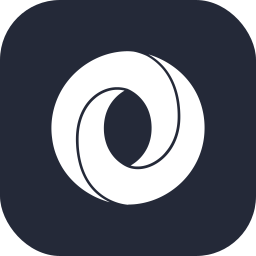
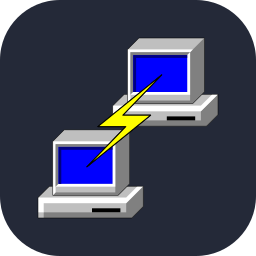
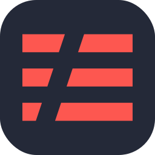
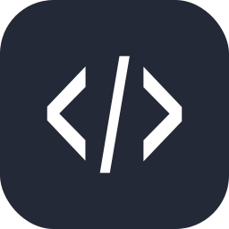

<div align="center">

  
  
  
  
  
  
  

  <!-- <a href="https://github.com/thuongtruong109/icoziv/pulls"></a> -->
  <!-- <a href="https://github.com/thuongtruong109/icoziv/graphs/contributors"></a> -->

  
  
</div>

## 📚 Contents

- [Example](#example)
- [Specifying Icons](#specifying-icons)
- [Themed Icons](#themed-icons)
- [Icons Per Line](#icons-per-line)
- [Centering Icons](#centering-icons)
- [Icons List](#icons-list)

## 🔍 Example

<p align="center"></p>
<p align="center"></p>

## 🏷️ Specifying Icons

Copy and paste the code block below into your readme to add the skills icon element!

Change the `?i=js,html,css` to a list of your skills separated by ","s! You can find a full list of icons [here](#icons-list).

```md
[](https://github.com/thuongtruong109/icoziv)
```

[](https://github.com/thuongtruong109/icoziv)

## 🎨 Themed Icons

Some icons have a dark and light themed background. You can specify which theme you want as a url parameter.

This is optional. The default theme is dark.

Change the `&theme=light` to either `dark` or `light`. The theme is the background color, so light theme has a white icon background, and dark has a black-ish.

**Light Theme Example:**

```md
[](https://github.com/thuongtruong109/icoziv)
```

[](https://github.com/thuongtruong109/icoziv)

## 📏 Icons Per Line

You can specify how many icons you would like per line! It's an optional argument, and the default is 15.

Change the `&perline=3` to any number between 1 and 50.

```md
[](https://github.com/thuongtruong109/icoziv)
```

[](https://github.com/thuongtruong109/icoziv)

## 📐 Centering Icons

Want to center the icons in your readme? The SVGs are automatically resized, so you can do it the same way you'd normally center an image.

```html
<p align="center">
  <a href="https://github.com/thuongtruong109/icoziv">
    
  </a>
</p>
```

<p align="center">
  <a href="https://github.com/thuongtruong109/icoziv">
    
  </a>
</p>

## 📋 Icons List

Here's a list of all the icons currently supported. Feel free to open an issue to suggest icons to add!

| Name | Icon | | Name | Icon | | Name | Icon |
| :---: | :--: | :-: | :---: | :--: | :-: | :---: | :--: |
| `1c` |  | | `ableton` |  | | `activitypub` |  |
| `actix` |  | | `adonis` |  | | `aftereffects` |  |
| `aiscript` |  | | `alpinejs` |  | | `anaconda` |  |
| `androidstudio` |  | | `angular` |  | | `ansible` |  |
| `apollo` |  | | `appcelerator` |  | | `apple` |  |
| `appwrite` |  | | `arch` |  | | `arduino` |  |
| `arm` |  | | `asm` |  | | `astro` |  |
| `atom` |  | | `audition` |  | | `autocad` |  |
| `aws` |  | | `azul` |  | | `azure` |  |
| `azuresqldatabase` |  | | `babel` |  | | `backbone` |  |
| `bash` |  | | `behance` |  | | `bevy` |  |
| `bitbucket` |  | | `blazor` |  | | `blender` |  |
| `bootstrap` |  | | `bsd` |  | | `bulma` |  |
| `bun` |  | | `c` |  | | `cakephp` |  |
| `canva` |  | | `cassandra` |  | | `chai` |  |
| `chartjs` |  | | `clion` |  | | `clojure` |  |
| `cloudflare` |  | | `cloudinary` |  | | `cmake` |  |
| `codeigniter` |  | | `codepen` |  | | `coffeescript` |  |
| `colab` |  | | `compose` |  | | `couchdb` |  |
| `cpp` |  | | `crystal` |  | | `cs` |  |
| `css` |  | | `cypress` |  | | `d3` |  |
| `dart` |  | | `dbeaver` |  | | `debian` |  |
| `deno` |  | | `devto` |  | | `directx` |  |
| `discord` |  | | `discordbots` |  | | `discordjs` |  |
| `django` |  | | `docker` |  | | `dotnet` |  |
| `dribble` |  | | `dynamodb` |  | | `echarts` |  |
| `eclipse` |  | | `elasticsearch` |  | | `electron` |  |
| `elixir` |  | | `elm` |  | | `elysia` |  |
| `emacs` |  | | `ember` |  | | `emotion` |  |
| `eslint` |  | | `excel` |  | | `expo` |  |
| `expressjs` |  | | `fastapi` |  | | `fediverse` |  |
| `figma` |  | | `firebase` |  | | `flask` |  |
| `flutter` |  | | `forth` |  | | `fortran` |  |
| `framermotion` |  | | `freecad` |  | | `gamemakerstudio` |  |
| `gatsby` |  | | `gcp` |  | | `gentoo` |  |
| `gherkin` |  | | `git` |  | | `github` |  |
| `githubactions` |  | | `gitlab` |  | | `gmail` |  |
| `godot` |  | | `golang` |  | | `googleanalytics` |  |
| `googleappsscript` |  | | `gradio` |  | | `gradle` |  |
| `grafana` |  | | `graphql` |  | | `gsap` |  |
| `gtk` |  | | `gulp` |  | | `hackerrank` |  |
| `hadoop` |  | | `haskell` |  | | `haxe` |  |
| `haxeflixel` |  | | `heroku` |  | | `hibernate` |  |
| `html` |  | | `htmx` |  | | `hydrogen` |  |
| `idea` |  | | `illustrator` |  | | `indesign` |  |
| `inkscape` |  | | `instagram` |  | | `ionic` |  |
| `ipfs` |  | | `java` |  | | `javascript` |  |
| `jekyll` |  | | `jenkins` |  | | `jest` |  |
| `jhipster` |  | | `jquery` |  | | `json` |  |
| `julia` |  | | `jupiter` |  | | `jupyter` |  |
| `kafka` |  | | `kali` |  | | `kotlin` |  |
| `ktor` |  | | `kubernetes` |  | | `lambda` |  |
| `langchain` |  | | `laravel` |  | | `latex` |  |
| `less` |  | | `linkedin` |  | | `linux` |  |
| `lit` |  | | `livewire` |  | | `locofy` |  |
| `lua` |  | | `mailchimp` |  | | `mariadb` |  |
| `markdown` |  | | `mastodon` |  | | `materialize` |  |
| `materialui` |  | | `matlab` |  | | `matplotlib` |  |
| `maven` |  | | `meshtastic` |  | | `metal` |  |
| `meteor` |  | | `mint` |  | | `misskey` |  |
| `ml5` |  | | `mocha` |  | | `mongodb` |  |
| `mongoose` |  | | `mybatis` |  | | `mybatisplus` |  |
| `mysql` |  | | `nativescript` |  | | `neo4j` |  |
| `neovim` |  | | `nestjs` |  | | `netlify` |  |
| `netty` |  | | `nextjs` |  | | `nginx` |  |
| `nim` |  | | `nix` |  | | `nodejs` |  |
| `nodered` |  | | `notion` |  | | `npm` |  |
| `numpy` |  | | `nuxtjs` |  | | `obsidian` |  |
| `ocaml` |  | | `octave` |  | | `openai` |  |
| `opencv` |  | | `opengl` |  | | `openshift` |  |
| `openstack` |  | | `oracle` |  | | `p5js` |  |
| `pandas` |  | | `perl` |  | | `photoshop` |  |
| `php` |  | | `phpstorm` |  | | `pinia` |  |
| `pkl` |  | | `plan9` |  | | `planetscale` |  |
| `playwright` |  | | `pnpm` |  | | `postcss` |  |
| `postgresql` |  | | `postman` |  | | `powershell` |  |
| `preact` |  | | `premiere` |  | | `prisma` |  |
| `processing` |  | | `prometheus` |  | | `protonmail` |  |
| `pug` |  | | `puppeteer` |  | | `putty` |  |
| `pwa` |  | | `pycharm` |  | | `python` |  |
| `pytorch` |  | | `qt` |  | | `quasar` |  |
| `qwik` |  | | `r` |  | | `rabbitmq` |  |
| `rails` |  | | `raspberrypi` |  | | `react` |  |
| `reactivex` |  | | `reactquery` |  | | `reactrelay` |  || `recoil` |  | | `redhat` |  | | `redis` |  |
| `redux` |  | | `regex` |  | | `remix` |  |
| `render` |  | | `replit` |  | | `rider` |  |
| `risc-v` |  | | `robloxstudio` |  | | `rocket` |  |
| `rollupjs` |  | | `ros` |  | | `ruby` |  |
| `rust` |  | | `salesforce` |  | | `sass` |  |
| `scala` |  | | `scikitlearn` |  | | `selenium` |  |
| `sentry` |  | | `sequelize` |  | | `serverless` |  |
| `servicenow` |  | | `shadcn` |  | | `shopify` |  |
| `sketchup` |  | | `slack` |  | | `socketio` |  |
| `solidity` |  | | `solidjs` |  | | `sonarqube` |  |
| `spring` |  | | `springboot` |  | | `springcloud` |  |
| `spyder` |  | | `sqlite` |  | | `sqlserver` |  |
| `stackoverflow` |  | | `storybook` |  | | `storybookjs` |  |
| `streamlit` |  | | `styledcomponents` |  | | `sublime` | |
| `supabase` |  | | `svelte` |  | | `svg` |  |
| `swagger` |  | | `swift` |  | | `swiftui` |  |
| `symfony` |  | | `tailwindcss` |  | | `tauri` |  |
| `tensorflow` |  | | `terraform` |  | | `testinglibrary` |  |
| `threads` |  | | `threejs` |  | | `thunderclient` |  |
| `thymeleaf` |  | | `trello` |  | | `twitter` |  |
| `typescript` |  | | `ubuntu` |  | | `unity` |  |
| `unrealengine` |  | | `v` |  | | `vala` |  |
| `vercel` |  | | `vim` |  | | `visualbasic` |  |
| `visualstudio` |  | | `visualstudiocode` |  | | `vite` |  |
| `vitest` |  | | `vscode` |  | | `vscodium` |  |
| `vuejs` |  | | `vuetify` |  | | `vulkan` |  |
| `webassembly` |  | | `webflow` |  | | `webpack` |  |
| `webstorm` |  | | `windicss` |  | | `windows` |  |
| `word` |  | | `wordpress` |  | | `workers` |  |
| `xamarin` |  | | `xcode` |  | | `xd` |  |
| `xml` |  | | `yarn` |  | | `yew` |  |
| `zabbix` |  | | `zig` |  | |    |    |

## 💖 Support the Project

Thank you so much already for using my projects! If you want to go a step further and support my open source work, buy me a coffee:

<a href='https://buymeacoffee.com/thuongtruong' target='_blank'></a>

To support the project directly, feel free to open issues for icon suggestions, or contribute with a pull request!
