<div align="center">

  
  [](https://thuongtruong109.github.io/icoziv)
  
  
  
  
  

  <!-- [](./LICENSE) -->
  <!-- <a href="https://github.com/thuongtruong109/icoziv/pulls"></a> -->
  <!-- <a href="https://github.com/thuongtruong109/icoziv/graphs/contributors"></a> -->

  
  
</div>

## 🐱‍💻 Hacktoberfest 2025

> 💡 This project is participating in Hacktoberfest 2025! We're excited to welcome contributions from the community. Feel free to open pull requests to add new icons or improve the project. Let's make it even better together!


#### How to Contribute

- Add new icons to the collection at [/icons](./icons) folder (see the [contributing guide](./CONTRIBUTING.md) for details).
- Add yourself to the [contributors list](./contributors.md) if you make a contribution.

## 📚 Contents

[](#-about)
[](#example)
[](#specifying-icons)
[](#themed-icons)
[](#icons-per-line)
[](#centering-icons)
[](#icons-list)

## 🧩 About

**Icoziv** is a fast, serverless service that generates beautiful skill and technology icon badges for your GitHub README files. Built with Cloudflare Workers for lightning-fast performance and global CDN distribution, it provides an easy way to showcase your tech stack with customizable themes and layouts.

Simply specify the technologies you use, and get a professional-looking SVG badge that automatically adapts to your README's theme.

## 🔍 Example

<p align="center"></p>
<p align="center"></p>

## 🏷️ Specifying Icons

Copy and paste the code block below into your readme to add the skills icon element!

Change the `?i=js,html,css` to a list of your skills separated by ","s! You can find a full list of icons [here](#icons-list).

```md
[](https://github.com/thuongtruong109/icoziv)
```

[](https://github.com/thuongtruong109/icoziv)

## 🎨 Themed Icons

Some icons have a dark and light themed background. You can specify which theme you want as a url parameter.

This is optional. The default theme is dark.

Change the `&theme=light` to either `dark` or `light`. The theme is the background color, so light theme has a white icon background, and dark has a black-ish.

**Light Theme Example:**

```md
[](https://github.com/thuongtruong109/icoziv)
```

[](https://github.com/thuongtruong109/icoziv)

## 📏 Icons Per Line

You can specify how many icons you would like per line! It's an optional argument, and the default is 15.

Change the `&perline=3` to any number between 1 and 50.

```md
[](https://github.com/thuongtruong109/icoziv)
```

[](https://github.com/thuongtruong109/icoziv)

## 📐 Centering Icons

Want to center the icons in your readme? The SVGs are automatically resized, so you can do it the same way you'd normally center an image.

```html
<p align="center">
  <a href="https://github.com/thuongtruong109/icoziv">
    
  </a>
</p>
```

<p align="center">
  <a href="https://github.com/thuongtruong109/icoziv">
    
  </a>
</p>

## 🗺️ API Reference

### Generate Icons

**Endpoint:** `GET /icons`

Generate an SVG badge with specified icons.

**Parameters:**
- `i` or `icons` (required): Comma-separated list of icon names
- `t` or `theme` (optional): Theme - `dark` (default) or `light`
- `perline` (optional): Number of icons per line (1-50, default: 15)

**Example:**
```
GET /icons?i=javascript,typescript,react,vue&theme=dark&perline=4
```

**Response:** SVG image

### Get Icon List

**Endpoint:** `GET /api/icons`

Returns a JSON array of all available icon names.

**Example:**
```
GET /api/icons
```

**Response:**
```json
["javascript", "typescript", "react", "vue", ...]
```

### Get SVG Data

**Endpoint:** `GET /api/svgs`

Returns a JSON object with all icon SVG data.

**Example:**
```
GET /api/svgs
```

**Response:**
```json
{
  "javascript": "<svg>...</svg>",
  "typescript": "<svg>...</svg>",
  ...
}
```

## 📋 Icons List

Here's a list of all the icons currently supported. Feel free to open an issue to suggest icons to add!

| Name | Icon | | Name | Icon | | Name | Icon |
| :---: | :--: | :-: | :---: | :--: | :-: | :---: | :--: |
| `1c` | 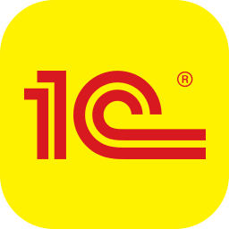 | | `7zip` |  | | `8th` | 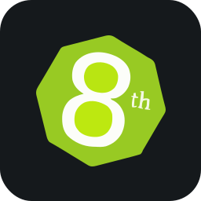 |
| `ableton` |  | | `activitypub` |  | | `actix` |  |
| `adobe` |  | | `adobeaftereffects` |  | | `adobeaudition` |  |
| `adobedreamweaver` |  | | `adobeexpress` | 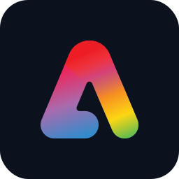 | | `adobeillustrator` |  |
| `adobeindesign` |  | | `adobelightroom` |  | | `adobephotoshop` |  |
| `adobepremiere` |  | | `adobexd` |  | | `adonis` |  |
| `airflow` |  | | `aiscript` |  | | `alacritty` | 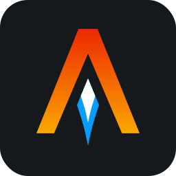 |
| `alchemy` | 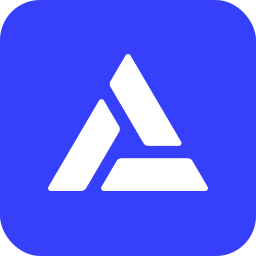 | | `alpinejs` |  | | `alpinelinux` |  |
| `amazonewebservices` |  | | `amazonwebservices` |  | | `anaconda` |  |
| `android` |  | | `androidstudio` |  | | `angularjs` | 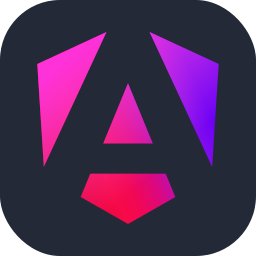 |
| `ansible` |  | | `antdesign` |  | | `anyscale` | 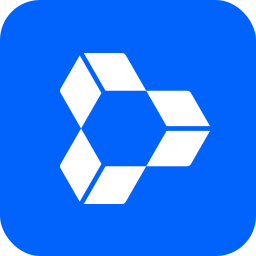 |
| `apache` |  | | `apachehadoop` |  | | `apachehive` | 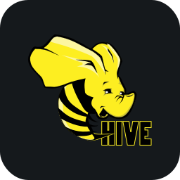 |
| `apachehop` |  | | `apachejmeter` | 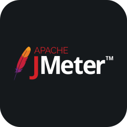 | | `apachemaven` |  |
| `apidog` | 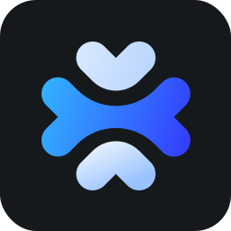 | | `apifox` | 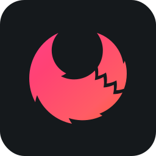 | | `apipost` |  |
| `apktool` |  | | `apollo` |  | | `appcelerator` |  |
| `appian` | 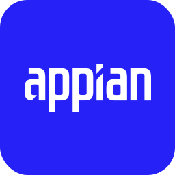 | | `appium` | 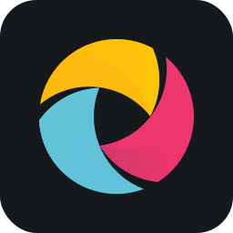 | | `apple` |  |
| `appwrite` | 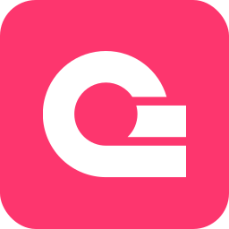 | | `arcbrowser` | 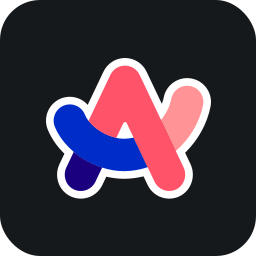 | | `archlinux` | 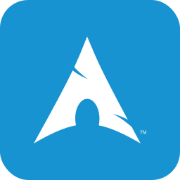 |
| `arduino` |  | | `argocd` |  | | `arm` | 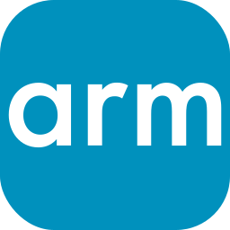 |
| `arturo` |  | | `asciidoctor` | 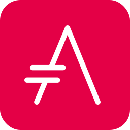 | | `aseprite` | 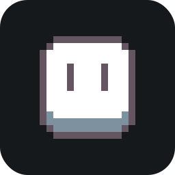 |
| `asm` |  | | `assembly` | 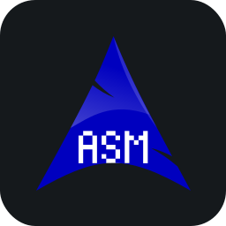 | | `astraluv` |  |
| `astro` | 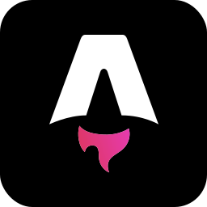 | | `atom` |  | | `auth0` |  |
| `authy` |  | | `autocad` |  | | `autohotkey` |  |
| `avaloniaui` |  | | `axios` |  | | `azul` |  |
| `azure` |  | | `azuresqldatabase` |  | | `babel` |  |
| `babylonjs` | 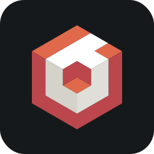 | | `backbone` |  | | `balenaetcher` | 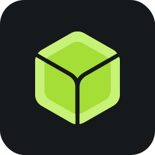 |
| `ballerina` | 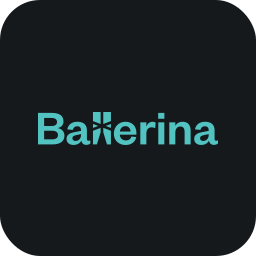 | | `baseui` |  | | `bash` |  |
| `batch` |  | | `beagleboard` |  | | `beeflang` | 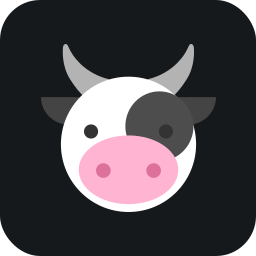 |
| `behance` |  | | `bento` | 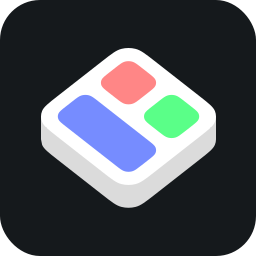 | | `betterauth` | 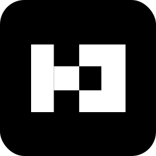 |
| `bevy` |  | | `bing` |  | | `biome` | 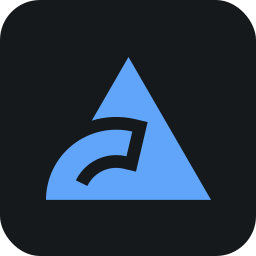 |
| `bitbucket` |  | | `blazor` |  | | `blender` |  |
| `bloc` | 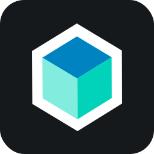 | | `bluesky` |  | | `bolt` |  |
| `bookstack` |  | | `bootstrap` |  | | `boundary` | 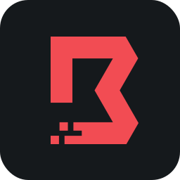 |
| `box2d` | 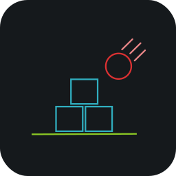 | | `brave` |  | | `bsd` |  |
| `bugsnag` | 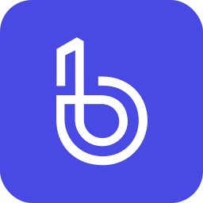 | | `builder` |  | | `bullmq` |  |
| `bulma` | 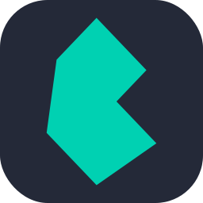 | | `bun` |  | | `burncloud` |  |
| `bytedance` |  | | `c` |  | | `caddyserver` |  |
| `cairo` | 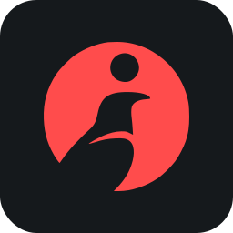 | | `cakebuild` | 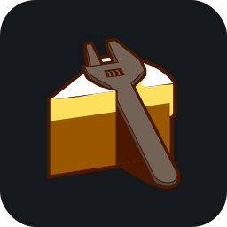 | | `cakephp` |  |
| `camtasia` |  | | `camunda` |  | | `canva` |  |
| `capacitorjs` | 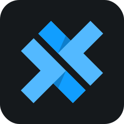 | | `capcut` | 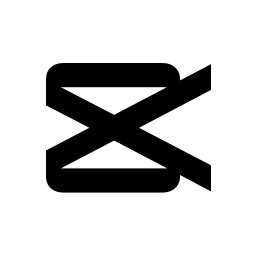 | | `cassandra` |  |
| `centos` |  | | `chai` |  | | `chakraui` | 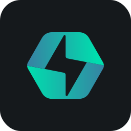 |
| `chartjs` | 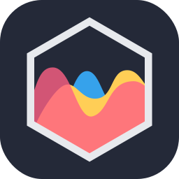 | | `chocolatey` |  | | `chromium` |  |
| `circleci` | 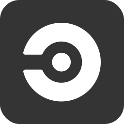 | | `cisco` |  | | `civitai` | 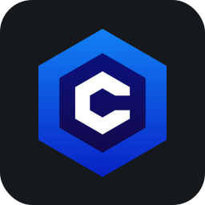 |
| `claudeai` |  | | `clerk` |  | | `clickhouse` | 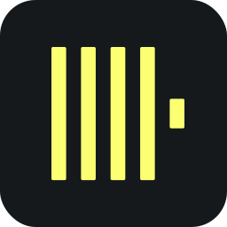 |
| `clickup` |  | | `cline` | 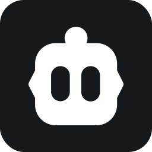 | | `clion` |  |
| `clojure` |  | | `cloudflare` |  | | `cloudinary` |  |
| `cmake` |  | | `cmder` | 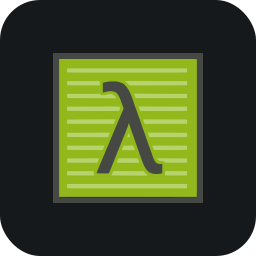 | | `codeberg` |  |
| `codeblocks` | 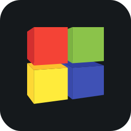 | | `codechef` |  | | `codecov` |  |
| `codeforces` | 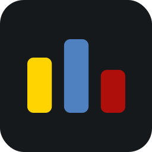 | | `codegeex` |  | | `codeigniter` |  |
| `codepen` |  | | `coffeescript` |  | | `cohere` | 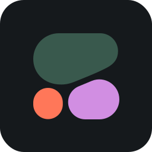 |
| `comfyui` | 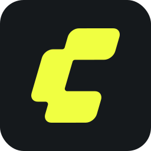 | | `commitlint` | 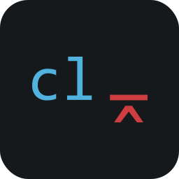 | | `compose` |  |
| `confluence` | 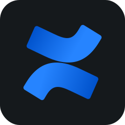 | | `consul` |  | | `cookiecutter` |  |
| `couchdb` |  | | `coze` |  | | `cpanel` |  |
| `cpp` |  | | `crusoe` |  | | `crystal` |  |
| `cs` |  | | `css` |  | | `cucumber` |  |
| `cudacplusplus` |  | | `curl` |  | | `curseforge` |  |
| `cursor` |  | | `cypress` |  | | `d3` |  |
| `dailydev` |  | | `daisyui` |  | | `dart` |  |
| `databricks` |  | | `datadog` |  | | `datagrip` |  |
| `datalore` |  | | `datefns` |  | | `dbeaver` |  |
| `dbt` |  | | `debian` |  | | `deepin` |  |
| `deepseek` |  | | `deno` |  | | `dependabot` |  |
| `designali` |  | | `devto` |  | | `digitalocean` |  |
| `directus` |  | | `directx` |  | | `discord` |  |
| `discordbots` |  | | `discordjs` |  | | `disqus` |  |
| `django` |  | | `djangorestframework` |  | | `dlang` |  |
| `dndkit` |  | | `dnspy` |  | | `docker` |  |
| `docus` |  | | `docusaurus` |  | | `dotnet` |  |
| `dribble` |  | | `drizzle` |  | | `dropbox` |  |
| `drupal` |  | | `duckdb` |  | | `dynamodb` |  |
| `easybuild` |  | | `echarts` |  | | `echo` |  |
| `eclipse` |  | | `edge` |  | | `effect` |  |
| `ejs` |  | | `elasticsearch` |  | | `electron` |  |
| `element` |  | | `elementor` |  | | `elementplus` |  |
| `elixir` |  | | `elm` |  | | `elysia` |  |
| `emacs` |  | | `ember` |  | | `emotion` |  |
| `erlang` |  | | `esbuild` |  | | `eslint` |  |
| `etcd` |  | | `eventbridge` |  | | `excel` |  |
| `expo` |  | | `expressjs` |  | | `fabricjs` |  |
| `facebook` |  | | `fastapi` |  | | `fastify` |  |
| `fdroid` |  | | `featuresliceddesign` |  | | `fediverse` |  |
| `fedora` |  | | `fiber` |  | | `figma` |  |
| `filezilla` |  | | `filmora` |  | | `firebase` |  |
| `firebaseailogic` |  | | `firebasestudio` |  | | `firefox` |  |
| `fivetran` |  | | `flask` |  | | `flatassembler` |  |
| `fleet` |  | | `flowbite` |  | | `flutter` |  |
| `flutterflow` |  | | `flyio` |  | | `forem` |  |
| `forth` |  | | `fortran` |  | | `framermotion` |  |
| `freebsd` |  | | `freecad` |  | | `fresh` |  |
| `fsharp` |  | | `gamemakerstudio` |  | | `ganache` |  |
| `gatsby` |  | | `gcp` |  | | `geany` |  |
| `genkit` |  | | `gentoo` |  | | `getx` |  |
| `gherkin` |  | | `ghostty` |  | | `gimp` |  |
| `gin` |  | | `git` |  | | `gitbash` |  |
| `gitbook` |  | | `gitea` |  | | `github` |  |
| `githubactions` |  | | `githubcopilot` |  | | `githubpages` |  |
| `gitkraken` |  | | `gitlab` |  | | `gitlocalize` |  |
| `gitmind` |  | | `gitpod` |  | | `gleam` |  |
| `gmail` |  | | `gnu` |  | | `godot` |  |
| `goland` |  | | `golang` |  | | `googleadk` |  |
| `googleadsense` |  | | `googleanalytics` |  | | `googleappsscript` |  |
| `googlechrome` |  | | `googlecloud` |  | | `googlecolab` |  |
| `googledrive` |  | | `googlegemini` |  | | `googleidx` |  |
| `gorm` |  | | `gradio` |  | | `gradle` |  |
| `grafana` |  | | `graphite` |  | | `graphql` |  |
| `gridsome` |  | | `grok` |  | | `groovy` |  |
| `groq` |  | | `grpc` |  | | `gruntjs` |  |
| `gsap` |  | | `gtk` |  | | `gulp` |  |
| `hackerrank` |  | | `hackthebox` |  | | `hacs` |  |
| `handycontrols` |  | | `haproxy` |  | | `hashicorp` |  |
| `hashnode` |  | | `haskell` |  | | `haxe` |  |
| `haxeflixel` |  | | `headlessui` |  | | `heroku` |  |
| `heroui` |  | | `hexo` |  | | `hibernate` |  |
| `homeassistant` |  | | `homebrew` |  | | `hono` |  |
| `hoppscotch` |  | | `hostgator` |  | | `html` |  |
| `htmx` |  | | `httpie` |  | | `hub` |  |
| `huggingface` |  | | `hugo` |  | | `hydrogen` |  |
| `hyper` |  | | `iceberg` |  | | `idea` |  |
| `ifttt` |  | | `inertiajs` |  | | `influxdb` |  |
| `inkscape` |  | | `insomnia` |  | | `instagram` |  |
| `intellijidea` |  | | `ionic` |  | | `ios` |  |
| `ipados` |  | | `ipfs` |  | | `java` |  |
| `javascript` |  | | `jekyll` |  | | `jenkins` |  |
| `jest` |  | | `jhipster` |  | | `jquery` |  |
| `json` |  | | `julia` |  | | `jupiter` |  |
| `jupyter` |  | | `kafka` |  | | `kali` |  |
| `kotlin` |  | | `ktor` |  | | `kubernetes` |  |
| `lambda` |  | | `langchain` |  | | `laravel` |  |
| `latex` |  | | `less` |  | | `linkedin` |  |
| `linux` |  | | `lit` |  | | `livewire` |  |
| `locofy` |  | | `lua` |  | | `mailchimp` |  |
| `mariadb` |  | | `markdown` |  | | `mastodon` |  |
| `materialize` |  | | `materialui` |  | | `matlab` |  |
| `matplotlib` |  | | `meshtastic` |  | | `metal` |  |
| `meteor` |  | | `mint` |  | | `misskey` |  |
| `ml5` |  | | `mocha` |  | | `mongodb` |  |
| `mongoose` |  | | `mybatis` |  | | `mybatisplus` |  |
| `mysql` |  | | `nativescript` |  | | `neo4j` |  |
| `neovim` |  | | `nestjs` |  | | `netlify` |  |
| `netty` |  | | `nextjs` |  | | `nginx` |  |
| `nim` |  | | `nix` |  | | `nodejs` |  |
| `nodered` |  | | `notion` |  | | `npm` |  |
| `numpy` |  | | `nuxtjs` |  | | `obsidian` |  |
| `ocaml` |  | | `octave` |  | | `openai` |  |
| `opencv` |  | | `opengl` |  | | `openshift` |  |
| `openstack` |  | | `oracle` |  | | `p5js` |  |
| `pandas` |  | | `perl` |  | | `php` |  |
| `phpstorm` |  | | `pinia` |  | | `pkl` |  |
| `plan9` |  | | `planetscale` |  | | `playwright` |  |
| `pnpm` |  | | `postcss` |  | | `postgresql` |  |
| `postman` |  | | `powershell` |  | | `preact` |  |
| `prisma` |  | | `processing` |  | | `prometheus` |  |
| `protonmail` |  | | `pug` |  | | `puppeteer` |  |
| `putty` |  | | `pwa` |  | | `pycharm` |  |
| `python` |  | | `pytorch` |  | | `qt` |  |
| `quasar` |  | | `qwik` |  | | `r` |  |
| `rabbitmq` |  | | `rails` |  | | `raspberrypi` |  |
| `react` |  | | `reactivex` |  | | `reactquery` |  |
| `reactrelay` |  | | `recoil` |  | | `redhat` |  |
| `redis` |  | | `redux` |  | | `regex` |  |
| `remix` |  | | `render` |  | | `replit` |  |
| `rider` |  | | `risc-v` |  | | `robloxstudio` |  |
| `rocket` |  | | `rollupjs` |  | | `ros` |  |
| `ruby` |  | | `rust` |  | | `salesforce` |  |
| `sass` |  | | `scala` |  | | `scikitlearn` |  |
| `selenium` |  | | `sentry` |  | | `sequelize` |  |
| `serverless` |  | | `servicenow` |  | | `shadcn` |  |
| `shopify` |  | | `sketchup` |  | | `slack` |  |
| `socketio` |  | | `solidity` |  | | `solidjs` |  |
| `sonarqube` |  | | `spring` |  | | `springboot` |  |
| `springcloud` |  | | `spyder` |  | | `sqlite` |  |
| `sqlserver` |  | | `stackoverflow` |  | | `storybook` |  |
| `storybookjs` |  | | `streamlit` |  | | `styledcomponents` |  |
| `sublime` |  | | `supabase` |  | | `svelte` |  |
| `svg` |  | | `swagger` |  | | `swift` |  |
| `swiftui` |  | | `symfony` |  | | `tailwindcss` |  |
| `tauri` |  | | `tensorflow` |  | | `terraform` |  |
| `testinglibrary` |  | | `threads` |  | | `threejs` |  |
| `thunderclient` |  | | `thymeleaf` |  | | `trello` |  |
| `twitter` |  | | `typescript` |  | | `ubuntu` |  |
| `unity` |  | | `unrealengine` |  | | `v` |  |
| `vala` |  | | `vercel` |  | | `vim` |  |
| `visualbasic` |  | | `visualstudio` |  | | `visualstudiocode` |  |
| `vite` |  | | `vitest` |  | | `vscode` |  |
| `vscodium` |  | | `vuejs` |  | | `vuetify` |  |
| `vulkan` |  | | `webassembly` |  | | `webflow` |  |
| `webpack` |  | | `webstorm` |  | | `windicss` |  |
| `windows` |  | | `word` |  | | `wordpress` |  |
| `workers` |  | | `xamarin` |  | | `xcode` |  |
| `xml` |  | | `yarn` |  | | `yew` |  |
| `zabbix` |  | | `zig` |  | | |  |

## ⚙️ Technologies

- Cloudflare Workers for hosting the icon API.
- JSON → GZIP + AES-CBC 256 + Base64 encoding for efficient and secure icon data transmission.
- TypeScript for type-safe development.
- Node.js for fallback server-side JavaScript execution.
- ESLint and Prettier for code quality and formatting.
- Vitest for testing

## 🤝 Contributing

We welcome contributions! See [CONTRIBUTING.md](CONTRIBUTING.md) for details.

## 💖 Support the Project

Thank you so much already for using my projects! If you want to go a step further and support my open source work, buy me a coffee:

<a href='https://buymeacoffee.com/thuongtruong' target='_blank'></a>

To support the project directly, feel free to open issues for icon suggestions, or contribute with a pull request!
